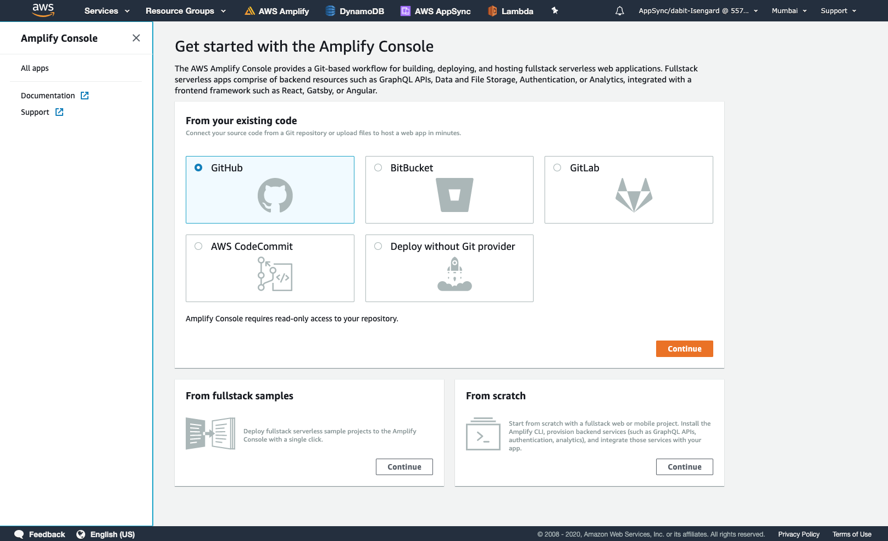
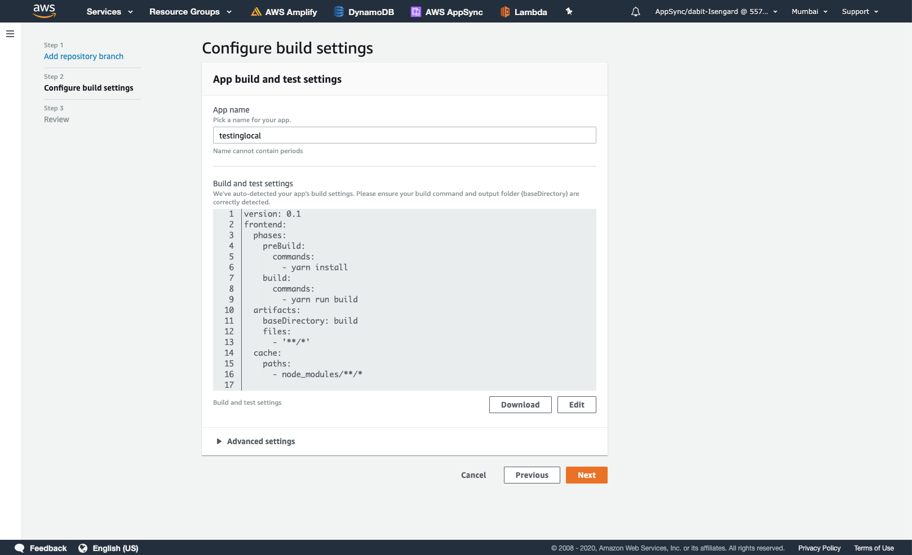
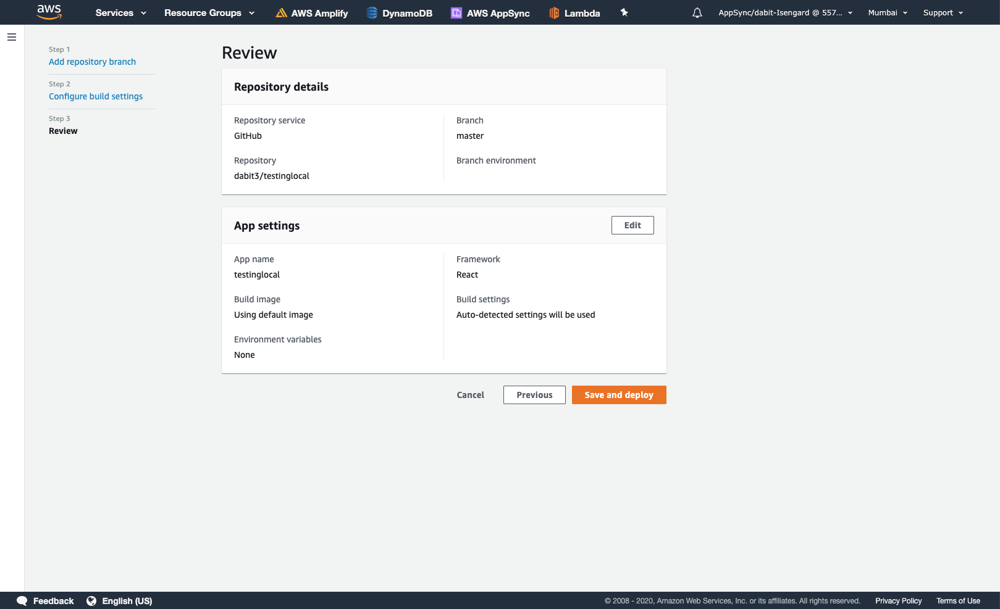
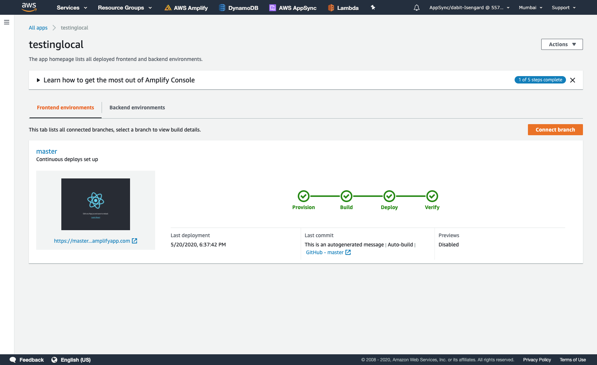
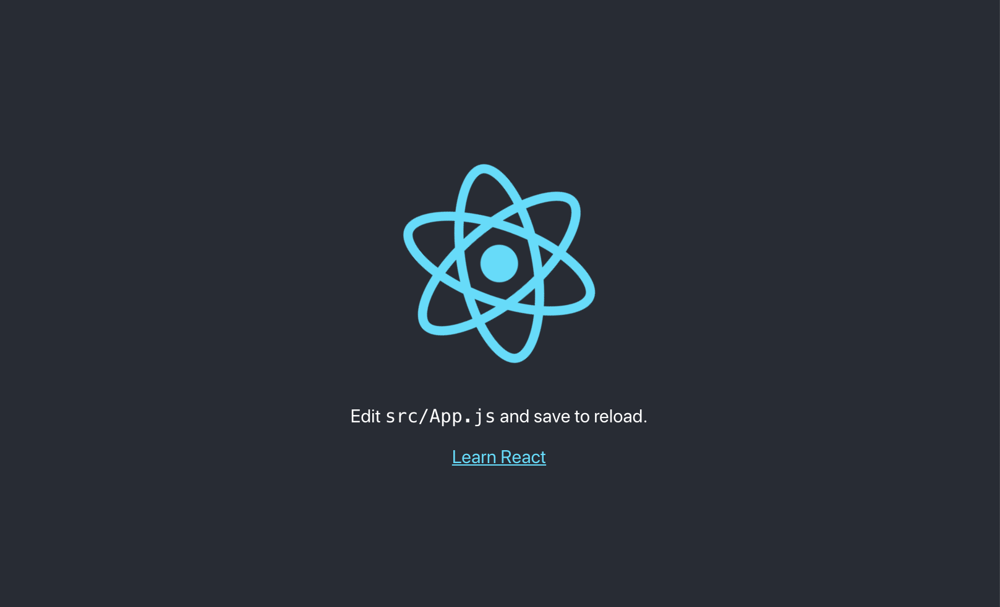
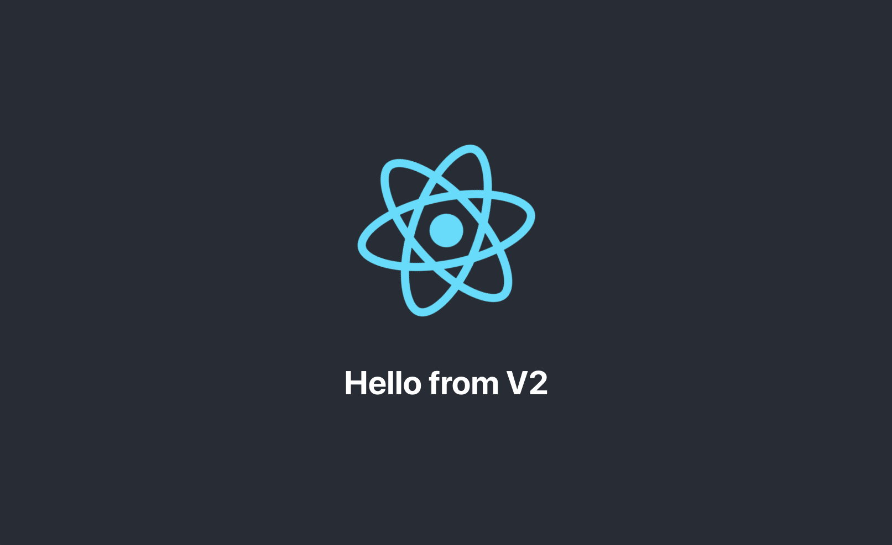

# Learning path (Frontend developer)

### What is a Frontend developer?
A front-end developer codes the visual design and interface of a website. They convert ideas and designs into HTML, JavaScript (JS) and/or CSS - the core elements of front-end development. This includes layout, content, buttons, images, navigation, and links.

### What will I learn

#### Hosting
- Set up and host your website on a Global CDN
#### Authentication
- Add authentication to your website
#### Data and storage
- Add an API, database, and image storage to your website

# Build a ReactJS Notes app 
Deploy and host a React app and add interactivity with a GraphQL API, Authentication, database, and image storage.

## Overview
- Attributes for the __Tutorial Summary Card__ (AWS experience level, time to complete, $ to complete, prerequisites)
- What you will learn
- Application Architecture
- Modules

# Module 1: Deploy and host a React app

AWS Amplify Console provides a Git-based CI/CD workflow for developing, deploying, and hosting single page web applications or static sites with serverless backends. Upon connecting to a Git repository, Amplify determines the build settings for both the frontend framework and any serverless backend resources configured with the Amplify CLI, and automatically deploys updates with every code commit.

In this tutorial, we’ll begin by creating a new React application and pushing it to a GitHub repository.  Then, we will connect the repo to the Amplify Console and deploy it to a globally available content delivery network (CDN) hosted on an amplifyapp.com domain. Next, we’ll demonstrate continuous deployment capabilities by making changes to the React application and pushing a new version to the master branch which will automatically kick off a new deployment.

Everything done in this tutorial is free tier eligible.

## 1. Sign up for AWS

You need an AWS account to following this tutorial on the AWS Amplify Console. There is no additional charge for using AWS Amplify with this tutorial. The resources you create in this tutorial are Free Tier eligible. 

[Sign up for AWS](https://portal.aws.amazon.com/billing/signup/iam?#/start)

## 2. Confirm environmental setup

Open your command line interface and enter the following command:

```sh
node -v;
```

If this command returns less than v8.0, upgrade node to a version greater than version 8. if the command not found, install the node from [nodejs.org/download](nodejs.org/download).

## 3. Create a new React application

The easiest way to create a React application is by using the command create-react-app. Install this package using the following command:

```sh
npx create-react-app amplifyapp
cd amplifyapp
npm start
```

## 4. Initialize GitHub repository

In this step, you will create a GitHub repository and commit your code to the repository. You will need a GitHub account to complete this step – if you do not have an account, sign up [here](here).

a. Create a new GitHub repo for your app ([link](https://github.com/new)).


b. Initialize git and push the application to the new GitHub repo executing the following commands in your command line interface:

```sh
git init
git remote add origin git@github.com:username/reponame.git
git add .
git commit -m ‘initial commit’
git push origin master
```

## 5. Log in to the AWS Amplify Console

Open the [AWS Management Console](AWS Management Console) in a new browser window, so you can keep this step-by-step guide open. When the screen loads, enter your user name and password to get started. Then type Amplify in the search bar and select AWS Amplify to open the service console.


## 6. Deploy your app to AWS Amplify

In this step, you will connect the GitHub repository you just created to the AWS Amplify service. This will enable you to build, deploy, and host your app on AWS.

a. Select Get Started under Deploy.


b. Select GitHub as the repository service and select Next.


c. Authenticate with GitHub and return to the Amplify Console. Choose the repository you created earlier and the master branch, then select Next.


d. Accept the default build settings and select Next.


e. Review the final details and select Save and Deploy.


f. AWS Amplify Console will now build your source code and deploy your app at https://<branchname>.<appid>.amplifyapp.com


g. Once the build completes, select the thumbnail to see your web app up and running live.


## 7. Automatically deploy code changes

In this step, you will make some changes to the code and push the changes to the master branch of your app.

a. Edit __src/App.js__

```sh
import React from 'react';
import logo from './logo.svg';
import './App.css';

function App() {
  return (
    <div className="App">
      <header className="App-header">
        
        <h1>Hello from V2</h1>
      </header>
    </div>
  );
}

export default App;
```

b. Push the changes to GitGub to automatically kick off a new build:

```sh
git add .
git commit -m 'changes for v2'
git push origin master
```

c. Once the build is complete, select the thumbnail on the AWS Amplify console to view your updated app.



## Congratulations 🎉
You have deployed a React application in the cloud by integrating with GitHub and using the Amplify Console.

With AWS Amplify Console, you can continuously deploy your application in the cloud and host it on a globally available CDN.

# Module 2: Initialize a local Amplify app

Now that we have initialize a new Amplify project in our account, we want to bring it down into our local environment so we can continue development and add new features. To do so, we'll install the Amplify CLI and initilize the Amplify project using the CLI.

## 1. Install the Amplify CLI

The Amplify Command Line Interface (CLI) is a unified toolchain to create AWS cloud services for your app. Let’s go ahead and install the Amplify CLI.

```sh
npm install -g @aws-amplify/cli
```

## 2. Configure the Amplify CLI

Amazon IAM (Identity and Access Management) enables you to manage users and user permissions in AWS. The CLI uses IAM to create and manage services programmatically on your behalf via the CLI.

To configure the CLI, run the `configure command`.

> To see a video walkthrough of the CLI configureation process, click [here](https://www.youtube.com/watch?v=fWbM5DLh25U).

```sh
amplify configure
```
## Initialize the Amplify app

Next, we will initialize an app locally. Since we have already created an Amplify, we can use this app configuration that has already been created.

a. In the Amplify console, click on __Backend environments__.


b. In the __Backend environments__ tab, copy the `amplify init` command to your keyboard


c. Initialize the Amplify project locally

```sh
amplify init --appId your-app-id

? Enter a name for the project: amplifyapp
? Enter a name for the environment: dev
? Choose your default editor: Visual Studio Code
? Choose the type of app that youre building: javascript
? What javascript framework are you using: react
? Source Directory Path: src
? Distribution Directory Path: build
? Build Command:  npm run-script build
? Start Command: npm run-script start
? Do you want to use an AWS profile? Y
? Please choose the profile you want to use: your-aws-profile
```

> Be sure that the profile you are choosing has been configured using the same region as the Amplify project you already deployed.

## Congratulations 🎉

You have initialzed the Amplify project and are now ready to start adding features!

To view your Amplify project in the dashboard at any time you can now run the following command:

```sh
amplify console
```

# Module 3: Add authentication

The next feature you will be adding is authentication. In this section, you will learn how to authenticate a user using Amazon Cognito, a managed user identity service.

You will also learn how to use the AWS Amplify UI component library to scaffold out an entire user authentication flow, allowing users to sign up, sign in, and reset their password with with just few lines of code.

Let's get started.

## 1. Install the Amplify libraries

We will be needing 2 amplify libraries for our project. The main `aws-amplify` library contains all of the client-side APIs for interacting with the various AWS services we will be working with and the `@aws-amplify/ui-react` library contains framework-specific UI components.

```sh
npm install aws-amplify @aws-amplify/ui-react
```

## 2. Create the authentication service

To create the authentication service, use the Amplify CLI

```sh
amplify add auth

? Do you want to use the default authentication and security configuration? Default configuration
? How do you want users to be able to sign in? Username
? Do you want to configure advanced settings? No, I am done.
```

## 3. Deploy the authentication service

Now that the authentication service has been configured locally, we can deploy it by running the Amplify `push` command.

```sh
amplify push --y
```

## 4. Configure the React project with Amplify resources

The CLI has created and will continue to update a file called __aws-exports.js__ located in the __src__ directory of our project. We will use this file to let the React project know about the different AWS resources that are available in our Amplify project. To configure our app with these resources, open __src/index.js__ and add the following code below the last import:

```js
import Amplify from 'aws-amplify';
import config from './aws-exports';
Amplify.configure(config);
```

## 5. Add the authentication flow in App.js

Next, open __src.App.js__ and update with the following code.

```js
import React from 'react';
import logo from './logo.svg';
import './App.css';
import { withAuthenticator, AmplifySignOut } from '@aws-amplify/ui-react'

function App() {
  return (
    <div className="App">
      <header>
        
        <h1>We now have Auth!</h1>
      </header>
      <AmplifySignOut />
    </div>
  );
}

export default withAuthenticator(App);
```

In this component we've used the `withAuthenticator` component. This component will scaffold out an entire user authentication flow allowing users to sign up, sign in, reset their password, and confirm sign in for multifactor authentication (MFA). We've also used the `AmplifySignOut` component which will render a Sign Out button.

## 6. Run the app locally

Next, run the app to see the new Authentication flow protecting the app:

```js
npm start
```

Here, you can try signing up which will then automatically sign you in. When signed in, you should be see a sign out button that will sign the user out and restart the authentication flow.


## 7. Deploy the changes to the live environment

Deply the changes to GitHub to kick off a new build in the Amplify console

```sh
git add .
git commit -m 'added auth'
git push origin master
```

## Congratulations 🎉

You have now added user authentication to your app!

# Module 4: Add a GraphQL API and database

Now that we've created and configured a the app with Authentication, let's add an API.

The API you will be creating in this step is a GraphQL API using AWS AppSync (a managed GraphQL service) backed by Amazon DynamoDB (a NoSQL database).

The app we will be building will be a Notes app that will allow users to create, delete, and list notes. This example will give you a good idea how to build many popular types of CRUD+L (create, read, update, delete, & list) applications.


## 1. Create a GraphQL API and database

a. Add a GraphQL API to your app by running the the following command from the root of your app directory:

```sh
amplify add api

? Please select from one of the below mentioned services: GraphQL
? Provide API name: notesapp
? Choose the default authorization type for the API: API Key
? Enter a description for the API key: demo
? After how many days from now the API key should expire: 7 (or your preferred expiration)
? Do you want to configure advanced settings for the GraphQL API: No
? Do you have an annotated GraphQL schema?  No
? Do you want a guided schema creation?  Yes
? What best describes your project: Single object with fields
? Do you want to edit the schema now? Yes
```

The CLI should open the GraphQL schema in your text editor.

__amplify/backend/api/myapi/schema.graphql__

Update the file with the following schema:

```graphql
type Note @model {
  id: ID!
  name: String!
  description: String
}
```

Next, save the file. Then go back to the command line and hit enter to complete the API configuration step.

## 2. Deploy the API

Now that the API has been configured locally it is time to deploy it. To do so, run the Amplify `push` command:

```sh
amplify push --y
```

This will do 3 things:

1. Create the AppSync API
2. Create a DynamoDB table
3. Create the local GraphQL operations in a folder located at __src/graphql__ that you can use to query the API

To view the GraphQL API in your account at any time, run the following command:

```sh
amplify console api

> Choose GraphQL
```

To view the Amplify app in your account at any time, run the following command:

```sh
amplify console
```

## 3. Writing the front end code to interact with the API

Now that the back end has been deployed, let's write some code to allow users to create, list, and delete notes.

Update __src/App.js__ with the following code:

```js
import React, { useState, useEffect } from 'react';
import './App.css';
import { API } from 'aws-amplify';
import { withAuthenticator, AmplifySignOut } from '@aws-amplify/ui-react';
import { listNotes } from './graphql/queries';
import { createNote as createNoteMutation, deleteNote as deleteNoteMutation } from './graphql/mutations';

const initialFormState = { name: '', description: '' }

function App() {
  const [notes, setNotes] = useState([]);
  const [formData, setFormData] = useState(initialFormState);
  useEffect(() => {
    fetchNotes();
  }, [])
  async function fetchNotes() {
    try {
     const apiData = await API.graphql({ query: listNotes });
     setNotes(apiData.data.listNotes.items);
    } catch (err) { console.log({ err })}
  }
  async function createNote() {
    try {
      if (!formData.name || !formData.description) return;
      await API.graphql({ query: createNoteMutation, variables: { input: formData } });
      setNotes([ ...notes, formData ]);
      setFormData(initialFormState);
    } catch (err) { console.log({ err })}
  }
  async function deleteNote({ id }) {
    const newNotesArray = notes.filter(note => note.id !== id);
    setNotes(newNotesArray);
    try {
      await API.graphql({ query: deleteNoteMutation, variables: { id }});
    } catch (err) { console.log({ err })}
  }
  return (
    <div className="App">
      <h1>My Notes App</h1>
      <input
        onChange={e => setFormData({ ...formData, 'name': e.target.value})}
        placeholder="Note name"
        value={formData.name}
      />
      <input
        onChange={e => setFormData({ ...formData, 'description': e.target.value})}
        placeholder="Note description"
        value={formData.description}
      />
      <button onClick={createNote}>Create Note</button>
      <div style={{marginBottom: 30}}>
        {
          notes.map(note => (
            <div key={note.id || note.name}>
              <h2>{note.name}</h2>
              <p>{note.description}</p>
              <button onClick={() => deleteNote(note)}>Delete note</button>
            </div>
          ))
        }
      </div>
      <AmplifySignOut />
    </div>
  );
}

export default withAuthenticator(App);
```

There are 3 main functions in our app:

a. `fetchNotes` - This function uses the `API` class to send a query to the GraphQL API and retrieve a list of notes.

b. `createNote` - This function also uses the `API` class to send a mutation to the GraphQL API, the main difference is that in this function we are passing in the variables needed for a GraphQL mutation so that we can create a new note with the form data.

c. `deleteNote` - Like `createNote`, this function is sending a GraphQL mutation along with some variables, but instead of creating a note we are deleting a note.

## 4. Run the app

To test out the app, run the `start` command:

```sh
npm start
```

## Congratulations 🎉

You have now created a Notes app! You added an AppSync GraphQL API and Amazon DynamoDB database as well as configured create, read, and delete functionality to your app.

# Module 5: Storing images

Now that we have the notes app working, let's add the ability to associate an image with each note.

To do so, we'll need to do three things:

1. Create the `storage` service using the Amplify CLI (`storage` uses Amazon S3 under the hood).
2. Update the GraphQL schema to associate an image with each note.
3. Update the React app to enable image uploading, fetching, and rendering.

## 1. Creating the Storage service

To add image storage, we'll use the Amplify `storage` category:

```sh
amplify add storage

? Please select from one of the below mentioned services: Content
? Please provide a friendly name for your resource that will be used to label this category in the project: imagestorage
? Please provide bucket name: <your-unique-bucket-name>
? Who should have access: Auth users only
? What kind of access do you want for Authenticated users? create, read, update, delete
? Do you want to add a Lambda Trigger for your S3 Bucket? N
```

## 2. Updating the GraphQL schema

Next, open __amplify/backend/api/notesapp/schema.graphql__ and update it with the following schema:

```graphql
type Note @model {
  id: ID!
  name: String!
  description: String
  image: String
}
```

Save the file.

## 3. Deploy the Storage service and API updates

Now that the storage service has been configured locally and we've updated the GraphQL schema, we can deploy the updates by running the Amplify `push` command.

```sh
amplify push --y
```

## 4. Update the React app

Now that the back end has been updated, let's update the React app to add the functionality to upload and view images for a note.

a. First add the `Storage` class to your Amplify imports.

```js
import { API, Storage } from 'aws-amplify';
```

b. In the main `App` function, create a new `onChange` function to handle the image upload

```js
async function onChange(e) {
  if (!e.target.files[0]) return
  const random = Math.random().toString(36).substring(7);
  const file = e.target.files[0];
  const fileName = `${random}-${file.name}`
  setFormData({ ...formData, image: fileName });
  try {
    await Storage.put(fileName, file);
    fetchNotes();
  } catch (err) { console.log({ err}) } 
}
```

c. Update the `fetchNotes` function to fetch an image if there is an image associated with a note

```js
async function fetchNotes() {
  try {
    const apiData = await API.graphql({ query: listNotes });
    const notesFromAPI = apiData.data.listNotes.items;
    await Promise.all(notesFromAPI.map(async note => {
      if (note.image) {
        const image = await Storage.get(note.image);
        note.image = image;
      }
      return note;
    }))
    setNotes(apiData.data.listNotes.items);
  } catch (err) { console.log({ err })}
}
```

d. Update the `createNote` function to add the image to the local image array if an image is associated with the note

```js
async function createNote() {
  try {
    if (!formData.name || !formData.description) return;
    await API.graphql({ query: createNoteMutation, variables: { input: formData } });
    if (formData.image) {
      const image = await Storage.get(formData.image);
      formData.image = image;
    }
    setNotes([ ...notes, formData ]);
    setFormData(initialFormState);
  } catch (err) { console.log({ err })}
}
```

e. Add an additional input to the form in the return block:

```js
<input
  type="file"
  onChange={onChange}
/>
```

f. When mapping over the notes array, render an image if it exists:

```js
{
  notes.map(note => (
    <div key={note.id || note.name}>
      <h2>{note.name}</h2>
      <p>{note.description}</p>
      <button onClick={() => deleteNote(note)}>Delete note</button>
      {
        note.image && 
      }
    </div>
  ))
}
```

## 5. Run the app

To test out the app, run the `start` command:

```sh
npm start
```

You should now be able to optionally upload an image for each note.

## Congratulations 🎉

You have now added image storage using Amazon S3 and integrated image storage into your app.

# Deleting the resources

## Removing individual services

To remove individual services, you can use the Amplify `remove` command:

```sh
amplify remove auth

? Choose the resource you would want to remove: <your-service-name>
```

Then run the Amplify `push` command:

```sh
amplify push
```

## Deleting the entire project

To delete the project and the associated resources, you can run the Amplify `delete` command:

```sh
amplify delete 
```